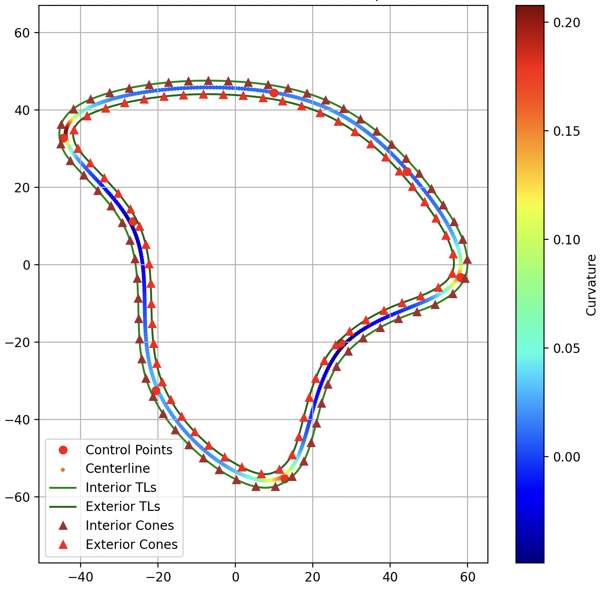

# FS Track Generator
This is a racetrack generator that creates tracks as similar as possible to Formula Student tracks. This is especially helpful for development and testing of driverless software.

Programmed entirely in Python and leveraging Scipy's cubic splines, can create randomly, Formula Student racetracks.

   
  Figure 1: Example plot with curvature.

## How does it work?
1. Create *n* control points around a **circle**.
2. Add **uniform noise** to these points.
3. From these points, generate a **cubic spline** that represents the **centerline** of the track. We can use a smoothing factor to smoothen the spline and avoid extremely high curvatures.
4. Generate parallel splines (representing inside and outside track limits) by offsetting the centerline.
5. Generate the cones that delimit the track by sampling from the track limits' splines. And add gaussian noise to its position.

## Parameters
By controlling the below stated parameters, you can control how do you want your tracks to be, e.g. pointy, roundy, with tight turns, etc.
- Number of control points of the initial circle.
- Radius of the initial circle.
- Amount of uniform noise to add to the control points.
- Smoothing factor of the splines.
- Width of the track.
- Spacing between cones.
- Standard deviation of cone positions.